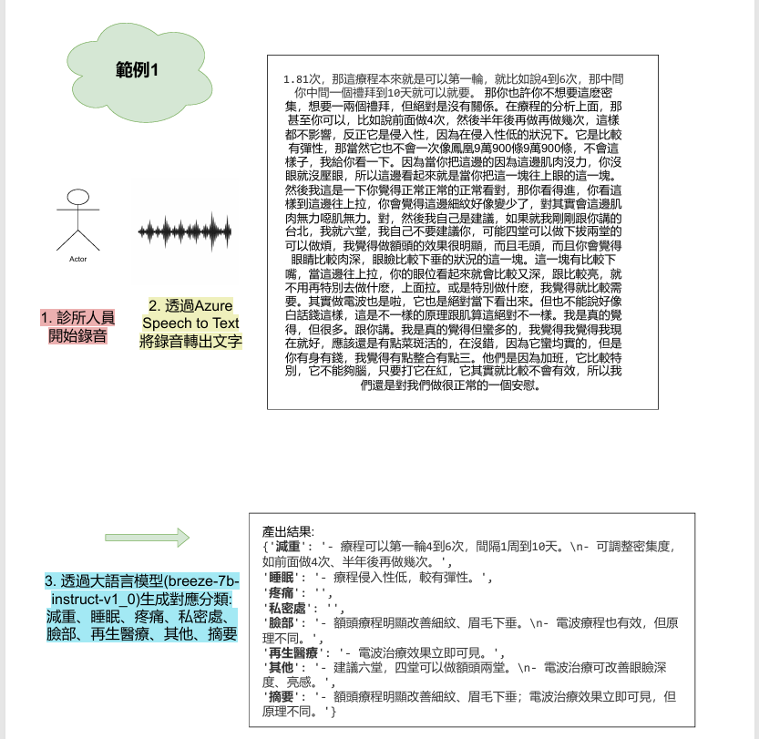

# Voice Record Assistant

## Purpose

This project is designed to assist **consultants**, **physical therapists**, and **physicians** in efficiently recording conversations with patients. It also helps automatically extract and structure key customer information during dialogues.

此專案旨在協助**諮詢師**、**物理治療師**與**醫師**，在與病人對話過程中有效紀錄對話內容，並自動整理病患的個人輪廓與重點資訊。

---

## Methodology

### 1. Data Preparation & Model Training
- Audio recordings are segmented into 30-second clips.
- Each clip is manually corrected and aligned with transcripts.
- These audio-text pairs are used to fine-tune **Azure Speech-to-Text**, along with collecting domain-specific vocabulary.

> 音檔會被切割成每段 30 秒，並進行人工校正後，與文字配對，作為訓練語音辨識模型（Azure Speech）的資料來源。  
> 同時收集相關專業術語，以提升辨識準確度。

### 2. Summarization with LLM
- Workflow: The transcribed text is processed to generate structured and concise consultation summaries.
- Initial Approach: We initially deployed the Ollama Breeze 7B model on AWS EC2 for cost-effective, self-hosted inference.
- Optimization: To meet the high standards for accuracy required by the business, we transitioned the underlying model to OpenAI's API (GPT-4o/GPT-3.5), ensuring more precise extraction of key medical information.

> 流程說明： 將語音轉寫後的文本輸入語言模型，生成結構化且精簡的看診摘要。
> 初期架構： 最初採用部署於 AWS EC2 的 Ollama Breeze 7B 模型，進行本地端推論以測試可行性。
> 架構優化： 考量到商業應用對於內容準確性的高標準要求，系統最終遷移至 OpenAI API，顯著提升了對話重點捕捉與病歷資訊的精確度。

---

## Demo Screenshot

---

## My Role

I was responsible for the **backend development**, including:

- Implementing the **WebSocket server** for real-time audio streaming  
- Integrating **Azure Speech-to-Text** for accurate voice transcription  
- Deploying and connecting a **self-hosted LLM (Ollama Breeze 7B)** on **AWS EC2** for summarization  
- Building a **frontend demo interface** to visualize the transcription and summary process

> 本人負責後端系統架構設計、語音辨識與摘要生成流程串接，並製作前端介面作為展示。

---

## Applications

- Medical consultation record automation  
- Physiotherapy session summarization  
- Aesthetic and wellness clinic records

---

## 專案結構

- consult_ws.py WebSocket service for the consultant's side. Handles real-time audio streaming and speech recognition for consultants.
- doct_ws.py WebSocket service for the doctor's side. Handles real-time audio streaming and speech recognition for doctors.
- index.html Frontend testing interface. Used to simulate WebSocket audio transmission and display speech recognition results.
- Legacy / Backup Files (main1.py, main.py, index1.html) These are previous iterations or backup files kept for reference.

> consult_ws.py 諮詢師用的 WebSocket 服務，負責接收諮詢師端語音並處理辨識。
> doct_ws.py 醫生用的 WebSocket 服務，負責接收醫生端語音並處理辨識。
> index.html 前端測試頁面，可用來模擬 WebSocket 語音傳輸與辨識結果。
> 其他檔案 (Other Files) main1.py, main.py, index1.html 是之前的修改檔。

## Author

**Vita Huang**  
Backend & AI Integration  
[GitHub @vitahuang629](https://github.com/vitahuang629)

