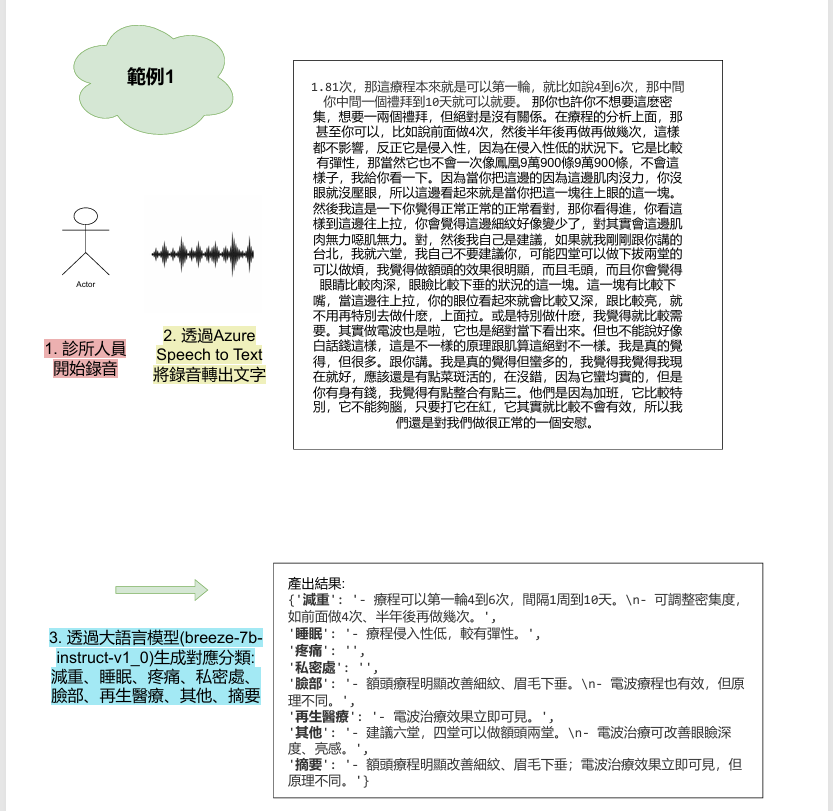

# 🎙️ Voice Record Assistant

## 🎯 Purpose

This project is designed to assist **consultants**, **physical therapists**, and **physicians** in efficiently recording conversations with patients. It also helps automatically extract and structure key customer information during dialogues.

此專案旨在協助**諮詢師**、**物理治療師**與**醫師**，在與病人對話過程中有效紀錄對話內容，並自動整理病患的個人輪廓與重點資訊。

---

## 🛠️ Methodology

### 1. Data Preparation & Model Training
- Audio recordings are segmented into 30-second clips.
- Each clip is manually corrected and aligned with transcripts.
- These audio-text pairs are used to fine-tune **Azure Speech-to-Text**, along with collecting domain-specific vocabulary.

> 音檔會被切割成每段 30 秒，並進行人工校正後，與文字配對，作為訓練語音辨識模型（Azure Speech）的資料來源。  
> 同時收集相關專業術語，以提升辨識準確度。

### 2. Summarization with LLM
- Transcribed text is passed to a **customized LLM** hosted on **AWS EC2**.
- We use the **Ollama Breeze 7B model** to generate structured and concise summaries of each consultation.

> 完成語音轉文字後，內容將傳送至架設於 AWS EC2 上的 LLM 模型，  
> 使用 **Ollama Breeze 7B** 進行摘要生成，協助記錄對話重點與病患資訊。

---

## 🖼️ Demo Screenshot

---

## 🙋‍♀️ My Role

I was responsible for the **backend development**, including:

- Implementing the **WebSocket server** for real-time audio streaming  
- Integrating **Azure Speech-to-Text** for accurate voice transcription  
- Deploying and connecting a **self-hosted LLM (Ollama Breeze 7B)** on **AWS EC2** for summarization  
- Building a **frontend demo interface** to visualize the transcription and summary process

> 本人負責後端系統架構設計、語音辨識與摘要生成流程串接，並製作前端介面作為展示。

---

## 📌 Applications

- Medical consultation record automation  
- Physiotherapy session summarization  
- Aesthetic and wellness clinic records

---

## 👨‍💻 Author

**Vita Huang**  
Backend & AI Integration  
[GitHub @vitahuang629](https://github.com/vitahuang629)

